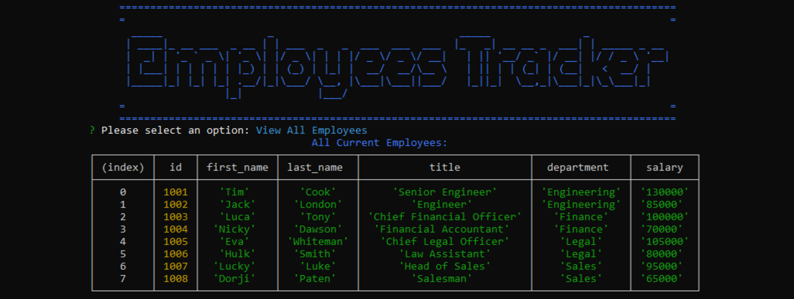

<h1 align="center"> MYSQL: 
<br>Employee Tracker 👋</h1>
<p align="center">
  <a href="#">
  
  <a href="#">
  
  
  
  
    
  <a href="https://www.buymeacoffee.com/adampham123">
  
  <a href="#">
  
  <a href="#">
  
  <a href="https://github.com/ThiHoangPham/employee-management-system/blob/main/LICENSE">
  
  </a>
  <a href="#">
  
  <a href="#">
  
  </a>
  <a href="#">
  
  </a>
  <a href="#">
  
  </a>
  <a href="https://twitter.com/AdamThaiHoang1">
  
  </a>
</p>
<hr>

## Description:
Build a command-line application from scratch to manage a company's employee database, using Node.js, Inquirer, and MySQL.

## User Story:
```
AS A business owner
I WANT to be able to view and manage the departments, roles, and employees in my company
SO THAT I can organize and plan my business
```
## Acceptance Criteria
```
GIVEN a command-line application that accepts user input
WHEN I start the application
THEN I am presented with the following options: view all departments, view all roles, view all employees, add a department, add a role, add an employee, and update an employee role
WHEN I choose to view all departments
THEN I am presented with a formatted table showing department names and department ids
WHEN I choose to view all roles
THEN I am presented with the job title, role id, the department that role belongs to, and the salary for that role
WHEN I choose to view all employees
THEN I am presented with a formatted table showing employee data, including employee ids, first names, last names, job titles, departments, salaries, and managers that the employees report to
WHEN I choose to add a department
THEN I am prompted to enter the name of the department and that department is added to the database
WHEN I choose to add a role
THEN I am prompted to enter the name, salary, and department for the role and that role is added to the database
WHEN I choose to add an employee
THEN I am prompted to enter the employee’s first name, last name, role, and manager, and that employee is added to the database
WHEN I choose to update an employee role
THEN I am prompted to select an employee to update and their new role and this information is updated in the database
```
## Table of Contents:
- [Description](#description)
- [User Story](#user-story)
- [Acceptance Criteria](#acceptance-criteria)
- [Walkthrough Video](#walkthrough-video)
- [Installation](#installation)
- [Test Instructions](#test-instructions)
- [Contributor](#contributor)
- [Contribution](#contribution)
- [Contact Information](#contact-information)

## Walkthrough Video: 
<a href="https://watch.screencastify.com/v/XKr8K5XFcqDU5NCiBB8j">
  
  </a>

## Installation:
`npm install`

## Test Instructions:
`node server.js`

## Contributor:
<a href="https://github.com/ThiHoangPham">
  
  </a>

## Contribution:
Please email to me if you have any contribution, I am more than happy with that. Thank you!

## Contact Information:

Github: [Thai Hoang(Adam), Pham](https://github.com/ThiHoangPham)

Email: thaihoangpham2008@gmail.com

<p align ="right"><a href="#">↥ back to top</a></p>

- - -

© 2021 Thai Hoang(Adam), Pham: Employee Tracker
